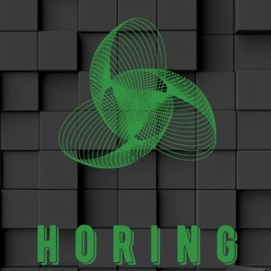
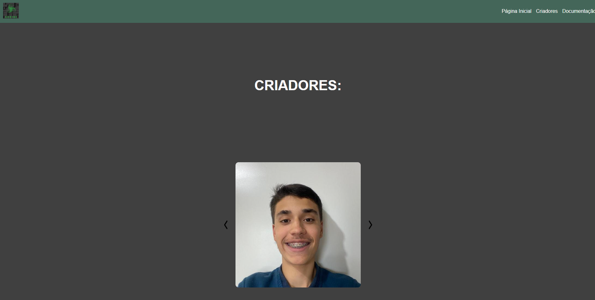
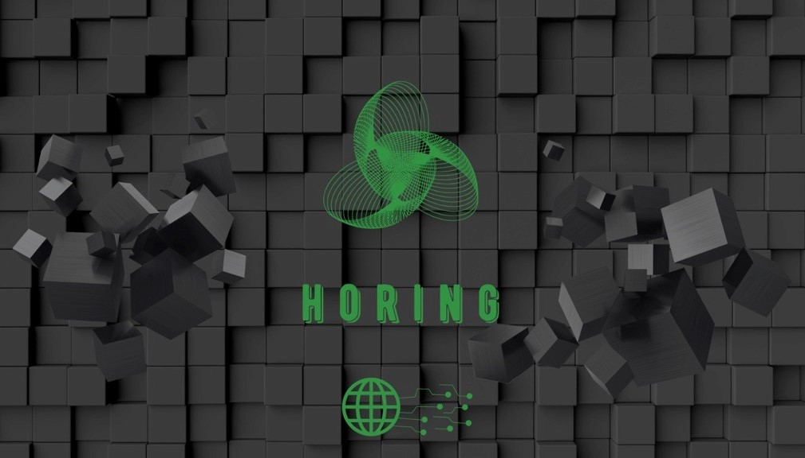

# Horing - Website

Horing é um Sistema Linux desenvolvidon por alunos do 3 semestre de ADS, da FATEC SCS - Antonio Russo. Este é o Website para a divulgação do Sistema Operacional.

## Screenshots

